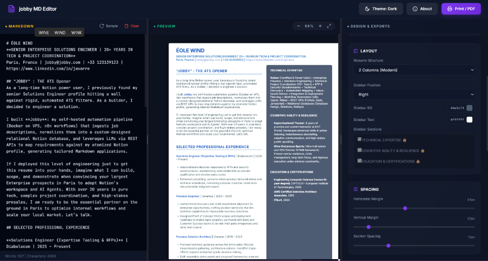

# jobby MD Editor 📄✨

A premium, interactive Markdown-to-HTML resume builder designed to blend elegant typography with flawless ATS (Applicant Tracking System) compliance. Co-designed by **Julien Avarre** and **Antigravity** (Google DeepMind team).



---

## 🌟 Key Features

* **Real-time A4 Canvas Preview**: Write standard Markdown on the left, watch your styled, print-ready document compile instantly on the right.
* **ATS Compliance Checker**: Real-time evaluation of parsing checklist items (contact info detection, tables/images warnings, standard heading validation, candidate name presence).
* **Premium Theme Customizer**: Proposes 4 color presets (Classic B&W, Dark Mode, Clean Blue, and manual Custom colors) alongside adjustable margins, section spacing, font scaling, and line heights.
* **Font Family Tiles**: Interactive font tiles to switch between modern layout systems (Inter, Raleway, Merriweather, Playfair Display, Lora, JetBrains Mono).
* **Two-Column Layout Engine**: Automatically split your resume into a main section and a custom sidebar (e.g. for skills or education) based on markdown headers.
* **Custom Directives**: Focus recruiter attention with custom markup handlers:
  * `:accent[text]` - colors text with the design accent color.
  * `:muted[text]` - fades text to secondary gray.
* **Drag-to-Resize Layout**: Simply drag handles to adjust the editor, preview, and controller widths to fit your workflow.
* **Automatic PDF Naming**: Smart parser extracts the candidate name and job title to dynamically construct the suggested file name (e.g., `javarre_enterprise_solutions_engineer.pdf`) for the browser print save dialog.
* **n8n / Clipboard Integrations**: Copy raw CSS, parsed inner HTML, or standalone HTML packages for seamless pipeline integration.

---

## 🚀 Running Locally

The application runs a lightweight local Python server to persist your edits (`resume.md` and `config.json`) back to disk.

1. Ensure Python 3 is installed.
2. Clone the repository and navigate to the project folder.
3. Start the server:
   ```bash
   python server.py
   ```
4. Open your browser and go to:
   ```text
   http://localhost:3000
   ```

---

## 💡 Acknowledgements & Credits

* **Inspiration**: This project was inspired by the clean markdown resume styling of [rozita-hasani/markdown-resume](https://github.com/rozita-hasani/markdown-resume).
* **Design & Engineering**: Built by **Julien Avarre** with the assistance of **Antigravity** (from the Google DeepMind Advanced Agentic Coding team).
