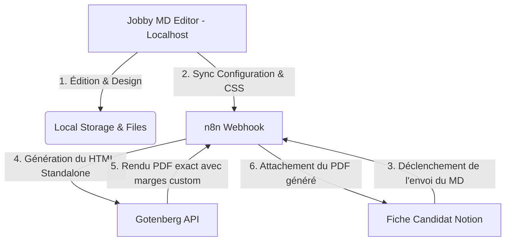

# REX (Retour d'Expérience) — Session de Co-Développement Jobby MD Editor

Ce document résume la session de pair-programming entre **Julien Avarre** et **Antigravity** (Google DeepMind). Il retrace les objectifs, les défis techniques résolus et l'architecture du projet **Jobby MD Editor** afin de servir de support pour vos futures démonstrations et présentations.

---

## 1. Vision & Objectifs du Projet
**Jobby MD Editor** est un éditeur de CV Markdown haut de gamme conçu pour allier :
1. **Une esthétique soignée et moderne** (layouts adaptatifs, typographies élégantes, thèmes d'interface ergonomiques).
2. **Une conformité ATS (Applicant Tracking System) stricte** pour garantir que le CV soit parfaitement analysable par les logiciels de recrutement (sans tableaux complexes, sans graphiques superflus, et avec un balisage propre).
3. **Un pipeline d'automatisation puissant** reliant l'éditeur local, un moteur **n8n**, une base de données **Notion**, et un générateur de PDF **Gotenberg**.

---

## 2. Défis Techniques Résolus & Solutions Implémentées

### 🛠️ Débogage et Robustesse du Pipeline n8n
* **Problème :** Le nœud *Javascript Code* dans le workflow n8n (responsable de la conversion MD -> HTML et de l'injection CSS) plantait régulièrement avec une erreur de syntaxe (`SyntaxError: Invalid or unexpected token`) à cause du traitement des retours à la ligne lors de la désérialisation du JSON.
* **Solution :** Remplacement complet des fonctions de découpage de chaînes s'appuyant sur des caractères littéraux (comme `split('\n')`) par des appels sécurisés via code ASCII : `split(String.fromCharCode(10))`. Cette méthode empêche n8n d'interpréter le retour à la ligne de manière prématurée.

### 📐 Refactoring du Layout 2-Colonnes & Alignement
* **Problème :** Gérer manuellement les sections à envoyer dans la barre latérale (*sidebar*) via les configurations de l'éditeur devenait rigide. De plus, les premières lignes des colonnes gauche et droite présentaient un décalage vertical inesthétique.
* **Solution :** 
  * Automatisation par les niveaux de titres Markdown : les titres de niveau **H2 (`##`)** placent la section dans la colonne principale, tandis que les titres **H3 (`###`)** la placent dans le sidebar.
  * Alignement vertical parfait en supprimant les marges supérieures du premier élément de chaque colonne (`*:first-child`) et en ajustant le padding interne de la colonne principale pour s'aligner sur la boîte du sidebar.

### ✍️ Interactivité Directe de la Checklist de Configuration
* **Problème :** La liste des sections à envoyer dans le sidebar était une configuration déconnectée de l'éditeur Markdown.
* **Solution :** Refonte complète du panneau de contrôle. L'éditeur liste dynamiquement toutes les sections H2/H3 détectées. Cocher ou décocher une case modifie directement le texte brut dans l'éditeur de gauche (remplace en temps réel `## Section` par `### Section` et inversement), mettant à jour le rendu visuel instantanément.

### 📄 Correction du Saut de Page Stricte (Bug CSS Grid)
* **Problème :** Lors de l'impression physique ou de l'export PDF sous Chrome, le navigateur découpait anormalement le CV sur deux pages (la colonne principale sur la page 1 et le sidebar sur la page 2), même si le contenu tenait largement sur une seule page.
* **Solution :** Les moteurs d'impression gèrent très mal le CSS Grid (`display: grid`) sur plusieurs pages. Nous avons désactivé le mode Grid lors de l'impression (via `@media print`) pour le remplacer par un système de **Flexbox proportionnel** (`display: flex`) avec des largeurs fixes en pourcentages (`58%` pour la colonne principale, `38%` pour le sidebar). Le CV tient désormais parfaitement sur **une seule page A4**.

### 🎨 Ajustement des Marges PDF (Gotenberg) & Graisse de Police
* **Problème :** Le PDF final généré par n8n/Gotenberg présentait des marges de 15mm fixes et rigides, ignorant les réglages de marges configurés sur l'éditeur. De plus, les intitulés de postes en gras (`strong`) apparaissaient parfois en police normale.
* **Solution :**
  * Remplacement du réglage rigide `@page { margin: 15mm; }` par `@page { margin: 0; }` au moment de l'impression. Les marges réelles du PDF sont maintenant définies par le *padding* de la feuille A4 (qui utilise les variables définies par les réglettes de l'éditeur).
  * Modification du poids de police de `#resume-output strong` de `600` (souvent ignoré par les moteurs d'impression sans connexion Internet) à **`700`** (true bold), forçant le navigateur à utiliser ou synthétiser un rendu gras très net.

### 👁️ Ergonomie Visuelle de l'Interface (Light Mode)
* **Problème :** Les grands espaces blancs de l'interface en mode Clair provoquaient une forte fatigue oculaire. De plus, il n'était pas évident visuellement de savoir si le volet Markdown était modifiable.
* **Solution :**
  * **Atténuation de l'éblouissement :** Remplacement des fonds blancs par une palette gris ardoise mat (`#e2e8f0` et `#f1f5f9`).
  * **Zone de saisie "Warm Paper" :** L'éditeur de code utilise désormais une teinte crème chaleureuse (`#fdfbf7`) imitant une feuille de bloc-notes.
  * **Focus dynamique :** L'activation de la zone de texte déclenche un contour violet lumineux (`:focus-within`) indiquant clairement l'interactivité.
  * Les barres de réglages invisibles en mode clair ont été dotées de lignes de fond gris solide (`#cbd5e1`).

### 💻 Intégration Git & WSL (Windows Subsystem for Linux)
* **Problème :** Les tentatives de push Git échouaient en tâche de fond sous Windows en raison de l'isolation des clés SSH et de la passphrase.
* **Solution :** Exécution native des commandes Git à travers le sous-système **WSL** (`wsl git push`), permettant de se brancher directement sur l'agent d'authentification SSH configuré sur votre Linux.

---

## 3. Architecture Logique du Projet

Le schéma ci-dessous illustre le flux de données du système Jobby :

---

## 4. Conclusion & Enseignements
Cette session a démontré la puissance du co-développement agentic / humain :
* **Vitesse d'itération :** Les bugs de CSS print complexes et d'encodage de chaînes n8n ont pu être isolés, corrigés et déployés en quelques minutes.
* **Expérience utilisateur (UX) :** Les retours de Julien sur la fatigue visuelle ont permis de faire passer l'interface d'un outil standard à une application véritablement premium et agréable pour un usage quotidien.
* **Portabilité :** Le stockage local autonome combiné à l'intégration Git via WSL garantit la pérennité du code pour vos futures présentations.
